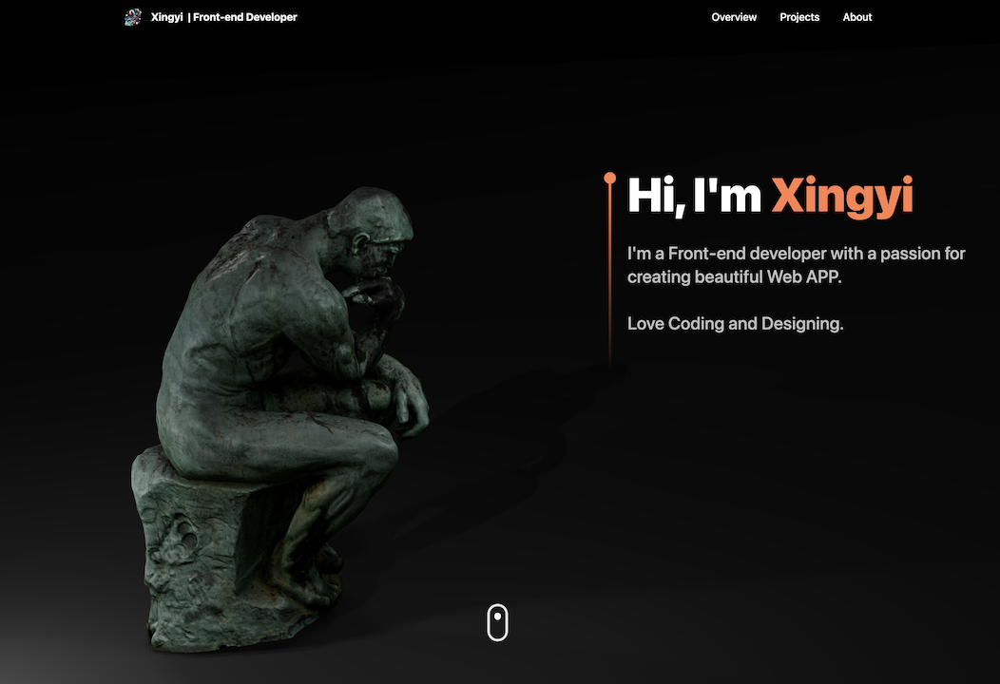

# 3D Profile Web

### _**It has been deployed on GitHub Pages.**_
### _**[Click here to see the web](https://mikalasa.github.io/ProfileWeb/)**_

## Introduction
This web app was developed using React, React-three-fiber, Tailwind CSS, and Framer Motion.
### It includes the following features:
- Interactive 3D profile display
- Custom Card Style
- Iframe for displaying external content in a 3D monitor
- Responsive UI for optimal viewing on all devices

***

# Instructions for Deploying Locally

## Setting Up the Project

- Clone the repository
- Navigate to the project directory
- Run `npm install`
- Run `npm start`

